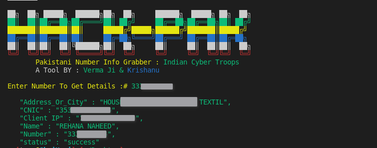

# Hack-Pak
Hack-Pak is Script to Gain Pakistani Number Details SDR (subscriber Data redord) Designed In Bash By Indian Cyber Troops
It's Paid Tool And Easy To Use And Execute Directly Without Anything
We Are Not Responsible For Any Damage Caused By Tool To Any Web And System We've Designed This For Educational Purpose 
If you Liked Tool Then just Star Repo And Contribute If You Can Thanks 
Just Execute And Enter Correct Option 
root permission is required to install essential packages 

# Notice: It Requires Key And Url Input In Script Contact Us For Both (Paid Only) Its Not Free $500 Without Guarantee /One Time Support 
## Key Will Be Shared With Authorized Person Only Not For Common Use 
Its Free For Intelligence Agencies And State Police (Only Indian) Cuz "Dil Hai Hindustani # Jai Hind"
## purpose
To Trace Scammers And Anti National Elements 
### Created By: Indian Cyber Troops 
Resource Management:R007 B45U 

Api And Database   :Verma ji

Tool Developement  :Krishanu Sharma
<p>
 <a href="https://www.youtube.com/c/indiancybertroops">
    
  </a>
    <a href="https://instagram.com/indiancybertroops">
    
  </a>
     <a href="https://t.me/indiancybertroops">
    
  </a>

</p>
   
   
# Main Phanto-M Image

# Features:
>Easy to Install

>Easy to Use

>Designed In Bash(shell scripting)

>Easy To Execue

>Fastest (Based On Internet Speed)

>Low Bandwith/Data Consume

>To Find Details Of Pak Numbers (+92 Only)

> Paid Tool
### Packages Needed: 
lynx: 
``` 
apt install lynx
```
## Installation Commands

``` 
apt install git
```
``` 
git clone https://github.com/indiancybertroops/Hack-Pak
```
``` 
chmod +777 *
```
``` 
./Hack-Pak.sh
```
or 
``` 
bash Hack-Pak.sh
````
# Github Status
[](https://github.com/indiancybertroops "Stats")<br>

## Contact Us: 


>Instagram
https://instagram.com/krishanuIND
>Instagram
https://instagram.com/Indiancybertroops


>Twitter
https://twitter.com/krishanuIND


>Github
https://github.com/indiancybertroops

## WARNING : 
***This tool is only for educational purpose. If you use this tool for other purposes except education we will not be responsible in such cases. We Are Not Responsible For Damage Caused By Tool***

[!] legal disclaimer: Usage of Hack-Pak for attacking targets without prior mutual consent is illegal. It is the end user's responsibility to obey all applicable local, state and federal laws. Developers assume no liability and are not responsible for any misuse or damage caused by this program
